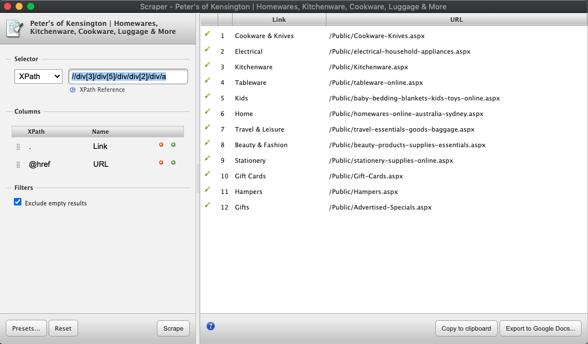
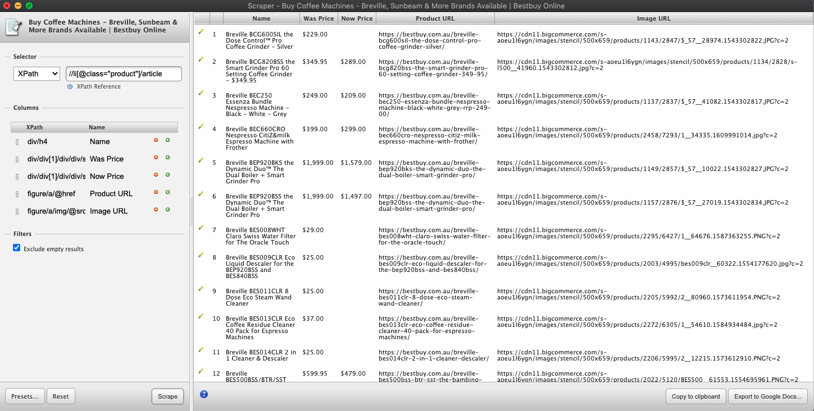
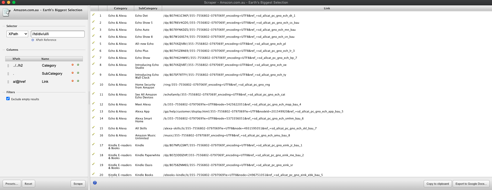

## XPaths Test
Test 1

Test 2

Test 3

## Python Test
**Scrapy**
The web scrapper is under the *aldi directory*. It is implemented using scrapy and xpath element selector.
The sample output of data is available and named `data.csv`
**Regex Test**
The answer for this test is provided in `re_challenges.py` file